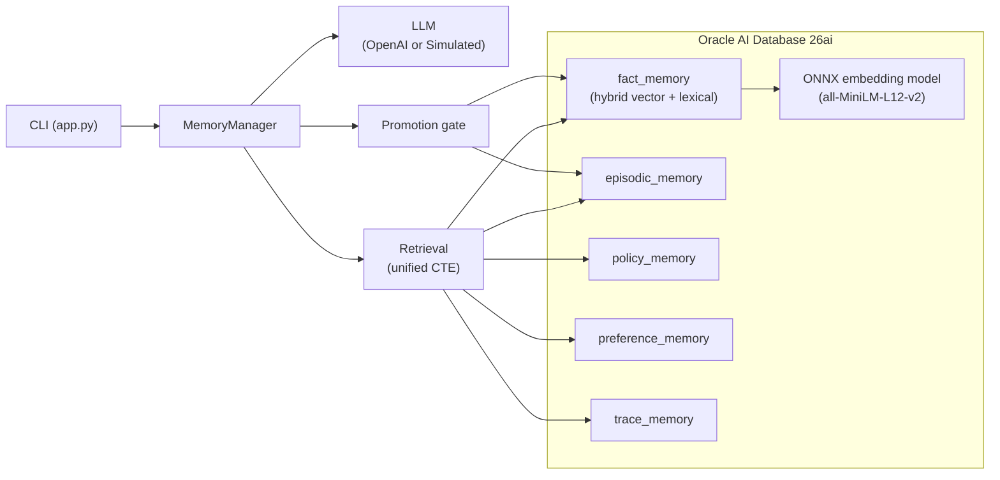

# Oracle Memory System Demo

Companion artifacts for [From RAG to Memory Systems: Building Stateful AI Architecture](https://blogs.oracle.com/developers/from-rag-to-memory-systems-building-stateful-ai-architecture) by Jeremy Daly.

Two artifacts share one `memory/` Python package:

- `app.py` — interactive CLI chat that demonstrates the loop turn-by-turn
- `notebooks/memory_loop_deep_dive.ipynb` — every query the app issues, dissected

## Architecture

Five typed memory stores in Oracle AI Database 26ai, each with a distinct lifecycle
(policy, preference, fact, episodic, trace). One unified CTE assembles the prompt
on every turn; a promotion gate guards every durable write.



## Prerequisites

- Oracle AI Database Free running locally:
  `docker run -d --name oracle-free -p 1521:1521 container-registry.oracle.com/database/free:latest-lite`
- A database user with `DB_DEVELOPER_ROLE` and `CTXAPP` grants
- Python 3.11–3.12

## Quick start

```bash
python -m venv .venv
source .venv/bin/activate
pip install -r requirements.txt

cp .env.example .env
# edit .env with your DB credentials

# 1. Create the typed memory tables.
python -m memory.ddl setup

# 2. Download the augmented ONNX embedding model (~120 MB) and copy it into
#    Oracle's DATA_PUMP_DIR, then load it.
python -m memory.onnx_loader
#    The script will print the docker cp command you need to run.

# 3. Seed the demo tenant with example policies, preferences, facts, and episodes.
python -m data.seed

# 4. Run the CLI.
python app.py

# Or, open the notebook:
jupyter notebook notebooks/memory_loop_deep_dive.ipynb
```

## Environment variables

All variables have defaults — the demo runs out of the box. Override anything in `.env`.

| Variable               | Default                   | Notes                                                                                                                              |
| ---------------------- | ------------------------- | ---------------------------------------------------------------------------------------------------------------------------------- |
| `ORACLE_DB_USERNAME`   | `memory_demo`             | Oracle DB user. Insecure default — change for anything beyond local dev.                                                           |
| `ORACLE_DB_PASSWORD`   | `memory_demo`             | Oracle DB password. Insecure default — change for anything beyond local dev.                                                       |
| `ORACLE_DB_DSN`        | `localhost:1521/FREEPDB1` | EZConnect string.                                                                                                                  |
| `DEMO_TENANT_ID`       | `acme-support`            | Scopes every row in the demo.                                                                                                      |
| `DEMO_USER_ID`         | `jane_doe@example.com`    | Raw identifier — the demo adds the `customer:` prefix itself; do not pre-prefix it.                                                |
| `DEMO_AGENT_ID`        | `agent:support_v1`        | Identity for the calling agent.                                                                                                    |
| `OPENAI_API_KEY`       | unset                     | If set, the demo uses OpenAI for the model + extraction layers. Without it, falls back to `SimulatedModel` + `RuleBasedExtractor`. |
| `OPENAI_MODEL`         | `gpt-4.1-mini`            | Override the OpenAI chat model.                                                                                                    |
| `FORCE_SIMULATED`      | unset                     | Truthy value forces the simulated stack even when `OPENAI_API_KEY` is set. CLI flag: `--simulated`.                                |
| `MEMORY_MIN_RELEVANCE` | `low`                     | Floor for fact/episode relevance tiers: `low`, `standard`, or `high`. CLI flag: `--min-relevance`. Demo-only convenience.          |

## Demo script

### LLM mode (`OPENAI_API_KEY` set)

A four-turn sequence that exercises every path of the loop. The LLM
extractor handles natural phrasing, so the turns read like a normal
support conversation:

```text
> Hi, I'm having trouble with my Stripe webhook again.
> By the way, I prefer terse answers; skip the pleasantries.
> Also, our production webhook URL is now https://api.acme.com/v2/stripe
> Thanks, that's all for now.
```

### Simulated mode (`--simulated` or `FORCE_SIMULATED=1`)

`SimulatedModel` returns a deterministic templated reply and
`RuleBasedExtractor` only fires on a narrow set of regex patterns, so
the typing script has to be more literal. The sequence below exercises
every gate path — preference write, dedup, supersession, fresh fact,
and the `/confirm` step:

```text
> I prefer terse answers
   → preference written (verbosity=terse).
> /preferences

> webhook URL is now https://api.acme.com/v2/stripe
   → fact superseded — the seed has v1 under the same (subject,
     predicate); the gate detects the contradiction and supersedes.
> /facts

> I prefer terse answers
   → deduplicated; the preference upserts to the same row.

> our production runs in us-west-2
   → fact written, status=provisional (no prior `deployment` fact).
> /facts
> /confirm <fact_id from /facts>
   → flips the row to active.

> /memory     # full state snapshot
> /prompt     # the assembled prompt the simulated model saw
> /trace      # last 5 trace events
> /run new    # simulate process restart; durable memory survives
```

Patterns the rule-based extractor recognizes (`memory/extraction.py`):

| Trigger              | Example                                                                                             |
| -------------------- | --------------------------------------------------------------------------------------------------- |
| Verbosity preference | `I (prefer\|like\|want\|need\|use) (terse\|brief\|verbose\|long\|short)`                            |
| Format preference    | `I (prefer\|...) (json\|markdown\|plain\|text)`                                                     |
| URL fact             | `(production\|staging\|webhook\|api\|url) ... (is\|is now\|changed to\|set to\|=\|:) https://...`   |
| Region fact          | `(we\|our\|production) ... (run\|host\|deploy\|are) ... (us-east-N\|us-west-N\|eu-west-N\|on-prem)` |

Anything outside those patterns produces no candidates, so the
simulated model just acknowledges and nothing reaches the gate.

### Inspecting state

Built-in slash commands work in both modes:

| Command              | What it does                                                          |
| -------------------- | --------------------------------------------------------------------- |
| `/help`              | Print the full command list.                                          |
| `/memory`            | Dump all current memory state for this tenant/user.                   |
| `/policies`          | Show active policy rows for the current tenant.                       |
| `/preferences`       | Show preference rows for the current tenant/user.                     |
| `/facts`             | Show fact rows (active + provisional grouped).                        |
| `/episodes`          | Show episodic rows for the current tenant.                            |
| `/trace`             | Show the last 5 trace events for the current run.                     |
| `/confirm <fact_id>` | Flip a provisional fact to `active`.                                  |
| `/run new`           | Start a new `run_id` without exiting (simulates a process restart).   |
| `/sql`               | Print the active unified retrieval query template.                    |
| `/prompt`            | Print the assembled prompt from the last turn (run a turn first).     |
| `/verbose [on\|off]` | Toggle full memory + prompt dump per turn.                            |
| `/reset confirm`     | Drop every demo table, re-create them, and re-seed. **Irreversible.** |
| `/quit`              | Exit the CLI.                                                         |

## License

Copyright (c) 2026 Oracle and/or its affiliates.

Licensed under the Universal Permissive License (UPL), Version 1.0.

See [LICENSE](./LICENSE) for more details.

ORACLE AND ITS AFFILIATES DO NOT PROVIDE ANY WARRANTY WHATSOEVER, EXPRESS OR IMPLIED, FOR ANY SOFTWARE, MATERIAL OR CONTENT OF ANY KIND CONTAINED OR PRODUCED WITHIN THIS REPOSITORY, AND IN PARTICULAR SPECIFICALLY DISCLAIM ANY AND ALL IMPLIED WARRANTIES OF TITLE, NON-INFRINGEMENT, MERCHANTABILITY, AND FITNESS FOR A PARTICULAR PURPOSE. FURTHERMORE, ORACLE AND ITS AFFILIATES DO NOT REPRESENT THAT ANY CUSTOMARY SECURITY REVIEW HAS BEEN PERFORMED WITH RESPECT TO ANY SOFTWARE, MATERIAL OR CONTENT CONTAINED OR PRODUCED WITHIN THIS REPOSITORY. IN ADDITION, AND WITHOUT LIMITING THE FOREGOING, THIRD PARTIES MAY HAVE POSTED SOFTWARE, MATERIAL OR CONTENT TO THIS REPOSITORY WITHOUT ANY REVIEW. USE AT YOUR OWN RISK.
