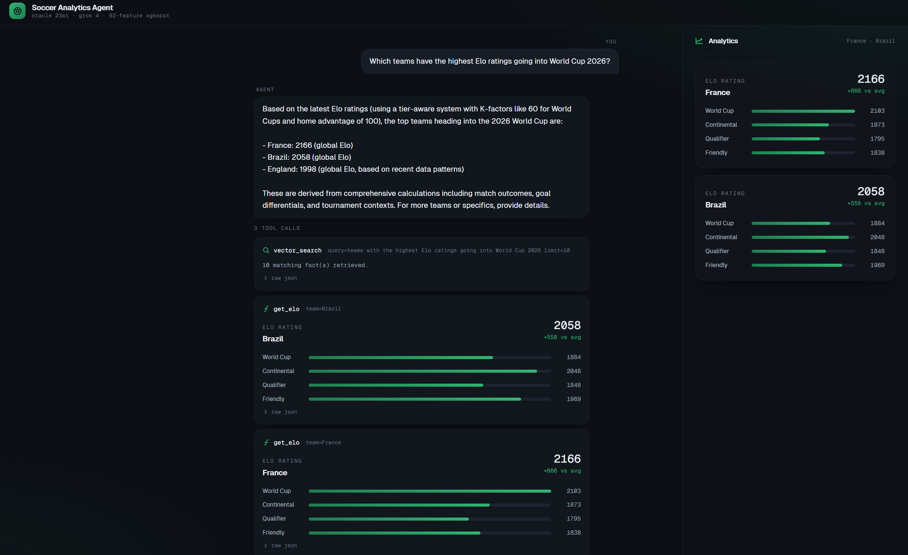

<h1 align="center">Soccer Analytics Agent</h1>

<p align="center">
  <strong>FIFA World Cup AI agent with Oracle AI Database as the entire memory layer.</strong> Three-tier memory. LangChain OracleVS hybrid retrieval. 92-feature XGBoost. One JDBC connection.
</p>

<p align="center">
  <a href="https://www.python.org/downloads/"></a>
  
  <a href="https://docs.oracle.com/en-us/iaas/Content/generative-ai/home.htm"></a>
  
  
  
  <a href="../../LICENSE"></a>
</p>

---



> This is the result you should reproduce after running the workshop end-to-end: Spain 56.7% / Draw 25.5% / Brazil 17.8% with the `predict_match` tool trace expanded, showing `features_used: 92`.

## What You Build

By the end of the workshop, attendees have a working agent that:

- Answers natural-language questions about 49,287 international matches (1872–2024).
- Calls 13 tools — `sql_query`, `hybrid_retrieve`, `vector_search`, `predict_match`, and six analytical tools mirroring the Reto Enseña 4.0 feature families (Elo, form, H2H, momentum, Poisson xG, tournament context).
- Stores conversation history and distilled facts as `VECTOR(384, FLOAT32)` rows in Oracle AI Database, searchable via `VECTOR_DISTANCE(... COSINE)`.
- After the ML model is trained and cached inference rows are loaded, creates a LangChain `OracleVS` vector store (`SOCCER_LANGCHAIN_DOCS`) from prediction documents plus football facts using the `langchain-oracledb` PyPI package.
- Demonstrates hybrid retrieval: native `OracleHybridSearchRetriever` on databases that support HYBRID VECTOR INDEX, with an Oracle AI Database-compatible Oracle Text + vector reciprocal-rank-fusion fallback.
- Shows the difference between hybrid retrieval and semantic-only vector search: `hybrid_retrieve` can recover cached ML prediction documents plus keyword/text evidence from `SOCCER_LANGCHAIN_DOCS`, while `vector_search` only ranks distilled facts from `semantic_memory`.
- Optionally showcases the `oracleagentmemory` PyPI package against the same Oracle database for durable user/agent/thread memories.
- Stores individual agent execution steps through `langgraph-oracledb` `OracleStore`, so every `/chat` turn leaves durable Oracle observability records for grounding, model responses, tool calls, tool results, and final answers.
- Predicts win/draw/loss probabilities through the same 92-feature pipeline that trained the model — *no more `predict_match` returning 33/33/33 on a zero feature vector.*

## The Feature Families (what the model actually sees)

The 92-feature XGBoost model is built from eight feature families. The first three are the classic core; the last five were added for Reto Enseña 4.0 to break past the ~57% accuracy ceiling. Each family answers a different question about a match.

| Family | What it represents | Why it predicts |
|--------|--------------------|-----------------|
| **Elo rating** | A single number for each team's strength, updated after every match since 1872. | Captures raw team quality — the strongest single predictor of who wins. |
| **Form** | Rolling results (win/draw/loss) and goal averages over a team's last N matches. | A team's recent trajectory often beats its long-run reputation. |
| **Head-to-head (H2H)** | The historical record between *these two specific teams*. | Some matchups defy the ratings (a "bogey team" rivalry). |
| **Goalscorer intelligence** | Scoring depth, star dependency, late goals, penalty reliance — from the goalscorers table. | How a team scores predicts whether it can score *here*, not just that it usually does. |
| **Momentum / psychology** | Win/loss streaks, clean-sheet rate, comeback rate, draw tendency. | Confidence and fragility are real and measurable across recent matches. |
| **Poisson xG** | Expected goals from a Poisson model of each team's scoring rate, plus over/under-performance. | Separates teams that *deserved* their results from lucky/unlucky ones. |
| **Venue / geography** | Altitude, confederation dynamics, home/neutral context. | Playing at altitude or far from home measurably shifts outcomes. |
| **Tournament context** | Group-vs-knockout behavior and a "big-game factor" (competitive minus friendly form). | Teams that coast in friendlies but rise in finals are systematically mispriced by form alone. |

For the full derivation — formulas, ablation results, and feature counts per family — see [docs/design/dataset-enhancement.md](docs/design/dataset-enhancement.md).

```
+--------------------------+        +--------------------------+
|  React UI (frontend/)    | <----> |  FastAPI service         |
|  Vite + Tailwind + FM    |  HTTP  |  /chat /predict /health  |
+--------------------------+        +-----------+--------------+
                                                |
                          +---------------------+---------------------+
                          |                                           |
                          v                                           v
              +-----------------------+               +-----------------------+
              |  Agent runtime        |               |  Inference service    |
              |  - Grok 4 (OCI GenAI) |               |  - 92-feature XGBoost |
              |  - 13 tools           |               |  - FeatureRuntime     |
              +-----------+-----------+               +-----------+-----------+
                          |                                       |
                          +-------------------+-------------------+
                                              |
                                              v
              +---------------------------------------------------+
              |  Oracle AI Database (container)                    |
              |  - 49k matches + 47k goals                        |
              |  - PREDICCIONES_FINAL (bulk predictions)          |
              |  - SOCCER_LANGCHAIN_DOCS (LangChain OracleVS)      |
              |  - LangGraph OracleStore step trace               |
              |  - working / episodic / semantic memory           |
              |  - VECTOR(384, FLOAT32) + in-DB ONNX embeddings   |
              +---------------------------------------------------+
```

How the families flow into a prediction:

```
  8 feature families                  assembled per match
+---------------------+
| Elo                 |\
| Form                | \
| H2H                 |  \      +-----------------------+      +-------------------+
| Goalscorer intel    |   +---> |  92-feature row       | ---> |  XGBoost model    |
| Momentum/psychology |   +     |  (FeatureRuntime      |      |  (best_model.pkl) |
| Poisson xG          |  /      |   .build_feature_row) |      +---------+---------+
| Venue/geography     | /       +-----------------------+                |
| Tournament context  |/                                                 v
+---------------------+                                   Win / Draw / Loss probabilities
```

## 92-feature ML pipeline


The model is built by replaying the canonical match history chronologically: extract pre-match tracker state, emit one feature row, then update trackers after the result. That produces **92 predictors** across Elo, recent form/goals, head-to-head, match context, goalscorer intelligence, momentum/psychology, Poisson xG, venue/geography, and tournament-context families. The editable source is [`docs/assets/ml_feature_pipeline.drawio`](docs/assets/ml_feature_pipeline.drawio); the detailed feature notes are in [`docs/ML_FEATURE_PIPELINE.md`](docs/ML_FEATURE_PIPELINE.md).

Elo is the foundation: every team starts at `1500`, non-neutral home teams receive `+100` expected-score points, match importance uses K-factors (`World Cup=60`, `continental=50`, `qualifier=40`, `friendly=20`), and larger wins apply a goal-difference multiplier before updating global and tournament-specific ratings.

## Dataset (canonical source)

**This workshop uses the Kaggle "International football results from 1872 to 2017" dataset by martj42.**

- URL: https://www.kaggle.com/datasets/martj42/international-football-results-from-1872-to-2017
- Updated periodically through 2024 by the maintainer.
- License: **CC0 1.0** (Public Domain) per the dataset page.
- This workshop copy already includes the required `data/` CSVs and production `models/` artifacts so attendees can run the setup without Kaggle credentials or local retraining.

**Do not substitute another dataset.** Every doc, notebook, feature-engineering routine, and SQL view in this repo assumes the schema produced by these specific CSVs. Replacing the source will silently break feature parity and reproducibility.

To refresh the dataset from the canonical source:

```bash
pip install kaggle  # one-time; needs ~/.kaggle/kaggle.json
kaggle datasets download -d martj42/international-football-results-from-1872-to-2017 -p data/ --unzip
```

## Quick Start

### 1. Sync the Python env (uv)

```bash
uv sync --all-groups
```

### 2. Configure the four OCI GenAI env vars

```bash
cp .env.example .env
# Paste the workshop-day OCI values: OCI_GENAI_API_KEY, OCI_COMPARTMENT_ID,
# and OCI_GENAI_ENDPOINT. Do not commit real values.
# Oracle defaults already match the workshop container.
```

The Oracle credentials in the second half of `.env` are dev-only defaults baked into the docker container — **do not change them**, the entire repo depends on those exact values. If you are the instructor and want a holding file before the event, use a local ignored file such as `.env.workshop.local`, then copy those three OCI values into `.env` on the day.

### 3. Bootstrap everything with one Claude Code skill

Open Claude Code in the repo and run:

```
/soccer-workshop-setup
```

The skill walks through Docker startup, schema creation, dataset load, model artifact preparation, ONNX embedding model load, prediction bulk-load, LangChain OracleVS hybrid vector-store population, semantic memory population, LangGraph OracleDB observability setup, and a green `verify.py` checklist. ~3-6 minutes on a warm laptop, depending on whether it needs to train the model locally.

<details><summary>Or run the steps manually</summary>

```bash
docker compose -f docker/docker-compose.yml up -d
uv run python scripts/setup_db.py
uv run python scripts/prepare_artifacts.py   # validates included artifacts or trains them
uv run python scripts/init_memory.py
uv run python scripts/load_onnx_model.py
uv run python scripts/load_predictions.py
uv run python scripts/load_langchain_vectors.py --reset
uv run python scripts/embed_match_facts.py
uv run python scripts/showcase_oracle_agent_memory.py  # optional SDK demo
uv run python scripts/verify.py              # all green
```

</details>

### 4. Build the web UI, then run the agent

The web UI is a **Vite + React + Tailwind + Framer Motion** app under `frontend/`. Build it once so FastAPI serves it at `/` (it falls back to the bundled `soccer_agent/api/static/index.html` if `frontend/dist/` is absent):

```bash
cd frontend && npm ci && npm run build && cd ..
uv run uvicorn soccer_agent.api.main:app --reload
# open http://localhost:8000/
```

The `taste-skill` is vendored at `.claude/skills/taste-skill/`, so you can invoke it from Claude Code to restyle `frontend/src/` and rebuild.

Ask "Predict Spain vs Brazil at a neutral venue" — you should see the same probabilities as the hero screenshot above (~56.7 / 25.5 / 17.8) with the `predict_match` tool trace showing `features_used: 92`.

Then ask the final showcase prompt: "Use hybrid retrieval to explain the evidence for Spain vs Brazil, and contrast it with semantic-only memory." Expand the trace: the answer should use `hybrid_retrieve` or startup hybrid grounding from `SOCCER_LANGCHAIN_DOCS`; `vector_search` should appear only as the semantic-only baseline contrast.

## The 13 Tools

| Tool | Purpose | Source |
|------|---------|--------|
| `sql_query` | Read-only SELECT against the soccer schema (allowlist + 5s timeout) | infrastructure |
| `vector_search` | Semantic-only similarity over distilled facts in `semantic_memory`; baseline/fallback path | infrastructure |
| `hybrid_retrieve` | Default explanatory retrieval over LangChain OracleVS prediction docs + football facts; native hybrid when available, Oracle Text + vector RRF fallback on Oracle AI Database | infrastructure |
| `lookup_prediction` | O(1) bulk lookup from `PREDICCIONES_FINAL` | infrastructure |
| `predict_match` | Live 92-feature XGBoost inference (assembles the feature row from the trackers below) | infrastructure |
| `remember` | Write a fact to `semantic_memory` with an embedding | infrastructure |
| `recall` | Read last N turns of `episodic_memory` | infrastructure |
| `GET /observability/{session_id}` | Read ordered LangGraph OracleDB step records for one chat session | infrastructure |
| **`get_elo`** | **FootballElo per tournament tier (notebook family 0)** | Reto Enseña ML |
| **`get_team_form`** | **Rolling form + weighted form + goal averages (family 0)** | Reto Enseña ML |
| **`get_h2h`** | **Head-to-head win rate, matches, goal diff (family 0)** | Reto Enseña ML |
| **`get_momentum`** | **Streaks, clean sheets, comebacks, draw tendency (family 2)** | Reto Enseña ML |
| **`get_poisson_xg`** | **Poisson expected-goals lambdas + outcome probs (family 3)** | Reto Enseña ML |
| **`get_tournament_context`** | **WC form, big-game factor (family 5)** | Reto Enseña ML |

The six bolded tools each map **1:1** to a feature family from the Reto Enseña 4.0 enhanced-features notebook. `predict_match` is the orchestrator: it calls `FeatureRuntime.build_feature_row()` which uses the exact same tracker classes (`FootballElo`, `TeamTracker`, `H2HTracker`, `MomentumTracker`, `PoissonTracker`, `TournamentTracker`) that trained the model.

For the full feature-family list and Elo formulas, see [ML Feature Pipeline Notes](docs/ML_FEATURE_PIPELINE.md).

## Oracle AI Database Features Used

| Feature | Usage |
|---------|-------|
| `VECTOR(384, FLOAT32)` columns | Embeddings for working, episodic, and semantic memory |
| `VECTOR_EMBEDDING(MODEL USING :t AS DATA)` | In-database text embedding — no external API |
| `VECTOR_DISTANCE(a, b, COSINE)` | Similarity search inside SQL |
| `langchain-oracledb` `OracleVS` | Inserts prediction/fact documents and embeddings into `SOCCER_LANGCHAIN_DOCS` |
| `langgraph-oracledb` `OracleStore` | Persists ordered agent-step observability records for every `/chat` turn |
| Oracle Text / HYBRID VECTOR INDEX | Hybrid keyword + semantic retrieval; native HYBRID-VECTOR-INDEX path with an Oracle AI Database-compatible RRF fallback |
| In-database ONNX models | `ALL_MINILM_L6_V2` loaded via `onnx2oracle`, 384-dim |
| JSON columns | Tool args + source provenance stored as native JSON |
| `FETCH FIRST :n ROWS ONLY` | Bounded windows for every per-team query |
| `cursor.callTimeout` | 5–8 s per-statement ceiling so the agent never hangs |

## Repository Layout

| Path | What |
|------|------|
| `soccer_agent/agent/` | Agent runtime — Grok client, tool dispatch, tool schemas, feature runtime |
| `soccer_agent/memory/` | Three-tier memory backed by Oracle AI Database plus LangChain OracleVS hybrid retrieval and optional Oracle Agent Memory SDK demo |
| `soccer_agent/inference/` | Bulk prediction lookup + live XGBoost inference |
| `soccer_agent/api/` | FastAPI surface + single-file static UI |
| `enhanced_features.py` | 1,100-line module: 7 trackers + the 92-feature pipeline |
| `notebooks/world_cup_enhanced.ipynb` | Full Reto Enseña 4.0 notebook — feature engineering, ablation, 6 models, Optuna, Monte Carlo |
| `scripts/` | One-shot setup, ingest, embedding-load, verify, smoke-test |
| `.claude/skills/` | Two Claude Code skills: `soccer-workshop-setup`, `soccer-agent-toolbelt` |
| `tests/` | 42 tests including 10 integration tests against the real Oracle dataset |
| `workshop/` | Attendee workshop notes, OCI setup, hackathon guide, and screenshots |

## Workshop Materials

- **Workshop overview:** [workshop/README.md](workshop/README.md)
- **Architecture:** [docs/ARCHITECTURE.md](docs/ARCHITECTURE.md)
- **OCI GenAI setup:** [workshop/OCI_GENAI_SETUP.md](workshop/OCI_GENAI_SETUP.md) — bearer-token auth, no OCI SDK
- **Hackathon guide (all 6 Reto Enseña levels):** [workshop/HACKATHON_GUIDE_ADB.md](workshop/HACKATHON_GUIDE_ADB.md)

## Why Oracle AI Database for the Memory Layer

Most agents in 2026 stitch together Postgres + Pinecone + LangChain + Redis. This repo does the equivalent with **one engine**:

- **Working memory** → relational k/v table (`working_memory`)
- **Episodic memory** → relational rows + a `VECTOR(384)` column for semantic recall of past turns
- **Semantic memory** → distilled fact rows + `VECTOR(384)` + `VECTOR_DISTANCE` for retrieval
- **LangChain vector store** → `SOCCER_LANGCHAIN_DOCS` populated by `langchain-oracledb` from prediction/fact documents for hybrid retrieval
- **LangGraph OracleDB observability** → `langgraph-oracledb` `OracleStore` records every model/tool/final step for each `/chat` turn
- **Oracle Agent Memory SDK demo** → optional `oracleagentmemory` tables with user/agent/thread-scoped durable memories
- **Bulk predictions** → relational table (`PREDICCIONES_FINAL`)
- **Match data** → relational tables (`MATCH_RESULTS`, `GOALSCORERS`, `SHOOTOUTS`) with analytical views

One JDBC connection. One SQL dialect. One backup story. ACID across the whole stack.

## Verify Your Setup

```bash
uv run python scripts/verify.py
```

Expected output:

```
Oracle:
Tables:
  ✓ MATCH_RESULTS: 49287 rows
  ✓ GOALSCORERS: 47601 rows
  ✓ SHOOTOUTS: 675 rows
  ✓ PREDICCIONES_FINAL: ≥2500 rows
  ✓ SOCCER_LANGCHAIN_DOCS: ≥300 rows
  ✓ AGENT_SESSIONS: 0 rows
  ✓ SEMANTIC_MEMORY: ≥300 rows
Embedding:
  ✓ ALL_MINILM_L6_V2 embed: (384,)
LangChain OracleDB:
  ✓ langchain-oracledb OracleVS import
LangGraph OracleDB observability:
  ✓ langgraph-oracledb OracleStore observability setup
Grok 4:
  ✓ Grok replied: 'PONG.'

All checks passed.
```

## Smoke Test (End-to-End)

```bash
uv run python scripts/smoke_test.py
```

Runs one real Grok 4 turn that asks for a Spain vs Brazil prediction. Expected reply: probabilities close to `0.567 / 0.255 / 0.178`, with `predict_match` listed as the tool used and `features_used: 92`. The smoke test also reads the `langgraph-oracledb` OracleStore step trace and expects events such as `turn_start`, `tool_call`, `tool_result`, and `final_response`. If you get uniform `0.33 / 0.33 / 0.33`, regenerate/promote the production artifacts with:

```bash
uv run python scripts/prepare_artifacts.py --force-retrain
uv run python scripts/load_predictions.py
```

## Running the Tests

```bash
uv run pytest tests/ --ignore=tests/test_grok_live.py
```

The suite includes unit tests plus integration tests against an isolated Oracle test schema (`ORACLE_TEST_USER`, default `<ORACLE_USER>_test`) so a normal test run does not erase the bootstrapped workshop/demo schema. The DB-backed checks still depend on the container being healthy.

## New Use Case: Match Intelligence Briefing

```bash
uv run python scripts/showcase_match_briefing.py --home Spain --away Brazil --focus broadcast
```

This presenter-ready use case calls the new `build_match_briefing` tool, which combines live 92-feature prediction, Elo/form/H2H/momentum/Poisson/tournament tool evidence, OracleVS hybrid retrieval, and semantic-only memory. By default the final prose rendering uses Grok through OCI GenAI with bearer-token auth loaded from `.env`; pass `--no-llm` for deterministic JSON-only validation.

## Extending the Agent

Three easy ways to build on this for your own use case:

1. **Add a new fact to semantic memory.** Use the `remember` tool from the chat: `remember(fact_type="venue_profile", subject_key="MetLife Stadium", summary="...")`. The agent retrieves it on the next turn as semantic-only memory.
2. **Refresh the hybrid vector store.** After retraining or changing prediction docs, run `uv run python scripts/load_langchain_vectors.py --reset` so `hybrid_retrieve` and final Grok answers see the latest LangChain OracleVS model evidence.
3. **Retrain the model.** `uv run python scripts/prepare_artifacts.py --force-retrain` retrains the 92-feature XGBoost in ~3 minutes against your local Oracle and promotes `models/best_model.pkl` plus `models/predictions.parquet`.
4. **Add a custom tool.** Add a new entry to `TOOL_SCHEMAS` in `soccer_agent/agent/tools.py` and a dispatch branch. Grok picks it up automatically on the next chat.

## Related Projects

- [visual-oracledb](https://github.com/jasperan/visual-oracledb) — Interactive showcase of Oracle AI Database features (JSON Duality, HNSW, RAG, ONNX)
- [tokenwatch](https://github.com/jasperan/tokenwatch) — AI token proxy powered by Oracle AI Database (semantic cache, budget kill switch)
- [f1-telemetry-oracle](https://github.com/jasperan/f1-telemetry-oracle) — F1 AI race engineer on Oracle AI Database (Vector Search + Spatial + JSON Duality + ONNX)
- [agent-application](https://github.com/jasperan/agent-application) — The application layer of the AI Agent Stack

## License

See the Oracle AI Developer Hub [LICENSE](../../LICENSE) for details.

Dataset is CC0 (public domain) per the Kaggle source.

---

<div align="center">

[](https://github.com/jasperan)&nbsp;
[](https://www.linkedin.com/in/jasperan/)&nbsp;
[](https://www.oracle.com/database/free/)

</div>
