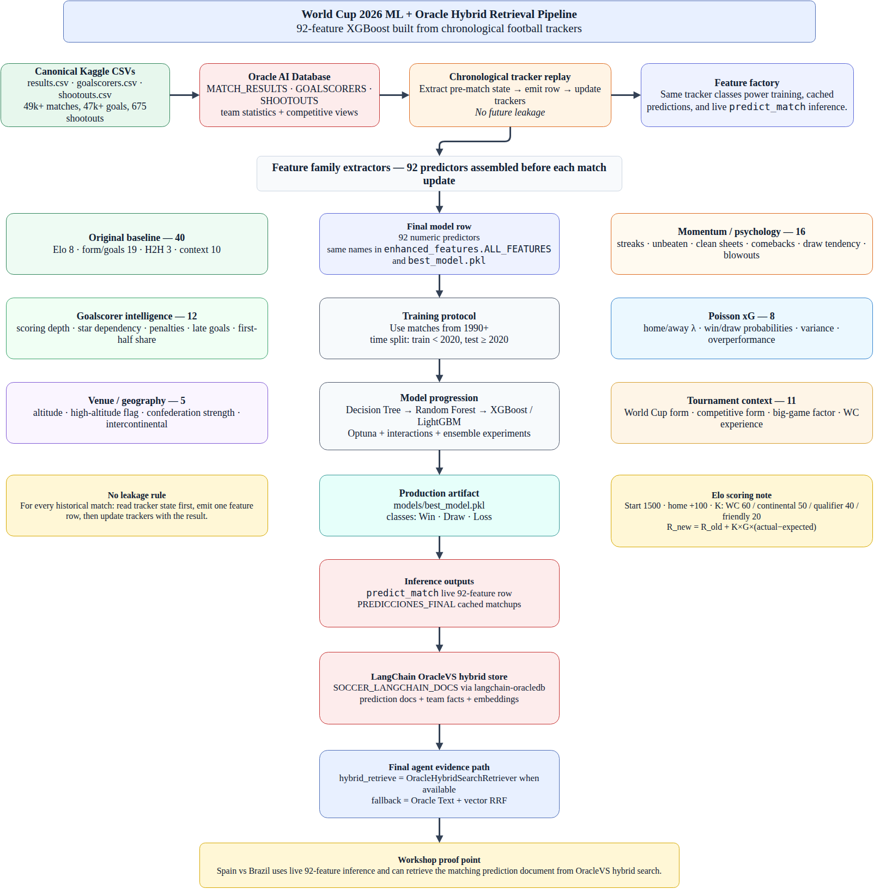

# Soccer Analytics Agent Workshop

This directory contains the runnable 90-minute workshop materials for the World Cup 2026 soccer analytics agent.

- [`OCI_GENAI_SETUP.md`](OCI_GENAI_SETUP.md) — OCI Generative AI setup notes.
- [`HACKATHON_GUIDE_ADB.md`](HACKATHON_GUIDE_ADB.md) — original Reto Enseña / Autonomous Database guide retained for reference.

## Final ML pipeline diagram



Editable draw.io source: [`../docs/assets/ml_feature_pipeline.drawio`](../docs/assets/ml_feature_pipeline.drawio)

Detailed feature notes: [`../docs/ML_FEATURE_PIPELINE.md`](../docs/ML_FEATURE_PIPELINE.md)

## What the model uses

The prediction engine is not a toy prompt wrapper. The final `predict_match` path builds the same **92-feature row** that trained the model:

| Feature family | Count | Why it matters |
|---|---:|---|
| Original baseline: Elo, form/goals, H2H, match context | 40 | Long-term strength, recent trajectory, pair history, venue/rest/tournament setup. |
| Goalscorer intelligence | 12 | Scoring depth, star dependency, penalties, late goals, first-half scoring. |
| Momentum / psychology | 16 | Streaks, unbeaten runs, clean sheets, comebacks, draw tendency, blowouts. |
| Poisson expected goals | 8 | Independent goal-rate model with lambdas, win/draw probabilities, variance, overperformance. |
| Venue / geography | 5 | Altitude, confederation strength, intercontinental matchup effects. |
| Tournament context | 11 | World Cup form, competitive form, big-game factor, World Cup experience. |
| **Total** | **92** | Full XGBoost input row for live and cached predictions. |

## Elo scoring note

The Elo system is replayed chronologically from the match dataset. Every team starts at `1500`; non-neutral home teams receive a `+100` expected-score bonus; and match importance is weighted by K-factor:

| Match category | K-factor |
|---|---:|
| FIFA World Cup | 60 |
| Continental championship | 50 |
| Qualifier / Nations League / default competitive | 40 |
| Friendly | 20 |

Expected score:

```text
E_home = 1 / (1 + 10^(-(R_home - R_away + HA) / 400))
```

Rating update:

```text
R_new = R_old + K * G * (S_actual - S_expected)
```

`G` is the goal-difference multiplier: `1.0` for one-goal-or-draw outcomes, `1.5` for two goals, `1.75` for three goals, and `1.75 + (GD - 3) / 8` for four or more.

## Retrieval and observability proof points

After predictions are created, `scripts/load_langchain_vectors.py` converts cached prediction rows and football facts into LangChain `OracleVS` documents in `SOCCER_LANGCHAIN_DOCS` using `langchain-oracledb`. The final Grok 4 chat should use `hybrid_retrieve` as the primary evidence path, then contrast it with semantic-only `vector_search` when requested.

Every `/chat` turn also writes ordered execution steps into Oracle through `langgraph-oracledb` `OracleStore`. Inspect them after a demo turn with:

```bash
curl http://localhost:8000/observability/<session_id> | uv run python -m json.tool
```

Expected events include `turn_start`, `grounding_retrieved`, `model_response`, `tool_call`, `tool_result`, and `final_response`.

Workshop demo prompt:

```text
Use hybrid retrieval to explain the evidence for Spain vs Brazil, and contrast it with semantic-only memory.
```
